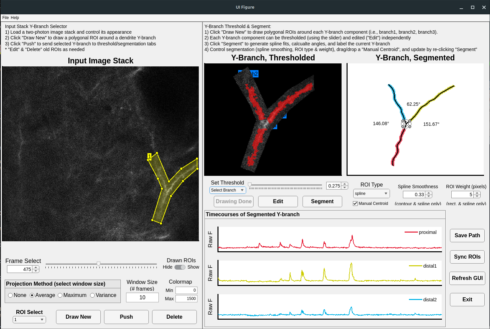

# ybranchROI
[20230930] made by $nks with $lxs $ack @kwanlab

Description: MATLAB GUI for segmenting y-branch ROIs from two-photon calcium imaging

Notes: We mocked up this GUI for segmenting dendritic y-branches in mid-2020 as a pandemic coding project. There is a little buggyness/some unresolved code issues, but it mostly works as expected and spits out a variety of segmented masks, angles, etc. Perhaps it will be of use to someone, somewhere, somehow. 
